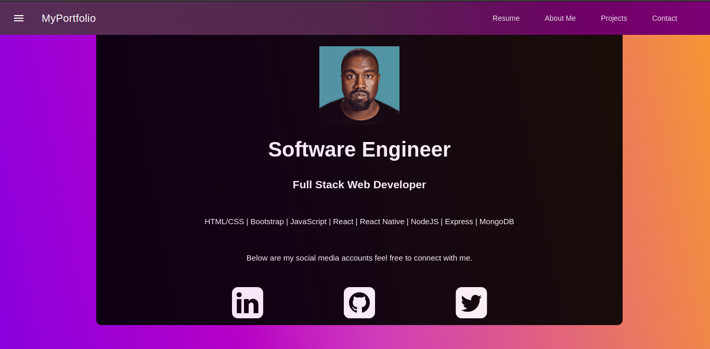

# my-portfolio-app
This personal portfolio app lets you add and edit projects.

[demo here]()

## Front-end Interface

You can use this app in conjunction with my project management API [see the repo](https://github.com/Austinjnr/portfolio-application-api)

### Installation and how to get started 

To use this rep on your machine, requires some simple steps:
- Open a terminal/ command line interface on your computer
- Clone the repo by;

        git clone git@github.com:Austinjnr/my-portfolio-app.git

- Once it creates a copy on your local machine for you.
- Change directory to the repo folder:

        cd my-portfolio-app/Client
        
- Open it in ``Visual Studio Code``

        code .

## Setup

1. Run `npm install --force` in your terminal

2. Run `npm start`. This will run your React app

## Features

- Create a project
- Update a projects name
- Delete a project
- View individul projects
